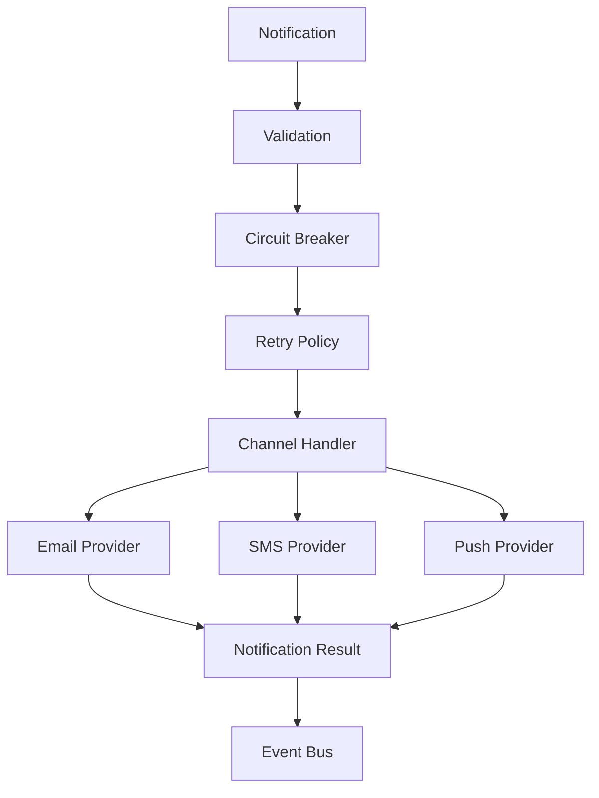

# Notifications Library


A lightweight, framework-agnostic notification library for Java 21+ that provides a unified API for sending Email, SMS, and Push notifications.

The library was designed with extensibility and clean architecture in mind, allowing applications to integrate multiple notification providers without depending on any specific framework such as Spring Boot.

It includes built-in support for asynchronous execution, batch processing, retry policies, circuit breakers, template rendering, event publishing, and multiple providers while keeping configuration entirely in Java code.

---

## Architecture Overview



## Features

- Java 21+
- Framework agnostic (no Spring Boot required)
- Maven project
- Unified notification API
- Builder-based configuration
- Email notifications
- SMS notifications
- Push notifications
- Multiple providers per channel
- Template rendering
- Retry policies
- Circuit Breaker
- Batch notifications
- Asynchronous notifications using `CompletableFuture`
- Event Bus
- Notification metrics
- Provider abstraction
- Validation framework
- Docker support
- Extensive unit tests

---

## Requirements

- Java 21 or newer
- Maven 3.9+

---

## Installation

Clone the repository

```bash
git clone https://github.com/bbayroc/challenge.git
```

Enter the project directory

```bash
cd challenge
```

Build the library

```bash
mvn clean package
```

Run all tests

```bash
mvn test
```

Generate the shaded JAR

```bash
mvn clean package
```

The executable JAR will be generated under

```
target/notifications-lib-1.0.0.jar
```

Run the demo

```bash
java -jar target/notifications-lib-1.0.0.jar
```
---

# Quick Start

The library can be used either through the high-level `NotificationSDK` or by creating a `NotificationManager` directly.

The SDK is the recommended entry point for most applications.

---

## Supported Channels

| Channel | Providers |
|----------|-----------|
| Email | SendGrid, Mailgun |
| SMS | Twilio |
| Push | Firebase, OneSignal |

---

## Sending an Email

```java
EmailConfiguration emailConfiguration =
        EmailConfiguration.builder()
                .provider(
                        new SendGridProvider(
                                SendGridConfiguration.builder()
                                        .apiKey("YOUR_API_KEY")
                                        .build()))
                .defaultFrom("noreply@example.com")
                .build();

SmsConfiguration smsConfiguration =
        SmsConfiguration.builder()
                .provider(
                        new TwilioProvider(
                                new TwilioConfiguration()))
                .build();

PushConfiguration pushConfiguration =
        PushConfiguration.builder()
                .provider(
                        new FirebasePushProvider(
                                FirebaseConfiguration.builder()
                                        .projectId("demo-project")
                                        .build()))
                .build();

try (NotificationSDK sdk =
             NotificationSDK.builder()
                     .email(emailConfiguration)
                     .sms(smsConfiguration)
                     .push(pushConfiguration)
                     .retryPolicy(
                             new ExponentialBackoffRetryPolicy(3))
                     .circuitBreaker(
                             new CircuitBreaker(3, 5000))
                     .build()) {

    NotificationResult result =
            sdk.send(
                    EmailNotification.builder()
                            .recipient("john@example.com")
                            .subject("Welcome")
                            .message("Hello from Notifications Library")
                            .build());

}
```

---

## Sending an SMS

```java
NotificationResult result =
        sdk.send(
                SmsNotification.builder()
                        .phoneNumber("+15551234567")
                        .message("Your verification code is 123456")
                        .build());
```

---

## Sending a Push Notification

```java
NotificationResult result =
        sdk.send(
                PushNotification.builder()
                        .deviceToken("device-token")
                        .title("Welcome")
                        .message("Your notification was delivered successfully.")
                        .build());
```

---

## Using NotificationManager

Applications requiring finer control over handlers and infrastructure components may use `NotificationManager` directly.

```java
NotificationManager manager =
        NotificationManager.builder()
                .handler(emailHandler)
                .handler(smsHandler)
                .handler(pushHandler)
                .retryPolicy(
                        new FixedRetryPolicy(3, 500))
                .circuitBreaker(
                        new CircuitBreaker(3, 5000))
                .build();

NotificationResult result =
        manager.send(notification);
```

---

## Notification Result

Every operation returns a `NotificationResult`.

```java
System.out.println(result.getStatus());
System.out.println(result.getProvider());
System.out.println(result.getMessageId());
System.out.println(result.getTimestamp());
```

Typical output

```text
Status      : SUCCESS
Provider    : SendGrid
Message Id  : 2d7bc6fa...
Timestamp   : 2026-06-05T14:30:18Z
```

---

# Configuration

The library is configured entirely through Java code.

No XML, YAML, annotations or external configuration files are required.

Every notification channel has its own configuration object, allowing applications to select providers and customize behavior while remaining completely framework independent.

---

## Email Configuration

```java
EmailConfiguration emailConfiguration =
        EmailConfiguration.builder()
                .provider(
                        new SendGridProvider(
                                SendGridConfiguration.builder()
                                        .apiKey("YOUR_API_KEY")
                                        .build()))
                .defaultFrom("noreply@example.com")
                .build();
```

or

```java
EmailConfiguration emailConfiguration =
        EmailConfiguration.builder()
                .provider(
                        new MailgunProvider(
                                MailgunConfiguration.builder()
                                        .apiKey("YOUR_API_KEY")
                                        .build()))
                .defaultFrom("noreply@example.com")
                .build();
```

---

## SMS Configuration

```java
SmsConfiguration smsConfiguration =
        SmsConfiguration.builder()
                .provider(
                        new TwilioProvider(
                                new TwilioConfiguration()))
                .build();
```

---

## Push Configuration

Firebase

```java
PushConfiguration pushConfiguration =
        PushConfiguration.builder()
                .provider(
                        new FirebasePushProvider(
                                FirebaseConfiguration.builder()
                                        .projectId("demo-project")
                                        .build()))
                .build();
```

OneSignal

```java
PushConfiguration pushConfiguration =
        PushConfiguration.builder()
                .provider(
                        new OneSignalPushProvider())
                .build();
```

---

## Retry Policies

The library includes two retry implementations.

### Fixed Retry

Retries using a constant delay.

```java
RetryPolicy retryPolicy =
        new FixedRetryPolicy(
                3,
                500);
```

---

### Exponential Backoff

Retries using exponentially increasing delays.

```java
RetryPolicy retryPolicy =
        new ExponentialBackoffRetryPolicy(
                3);
```

---

## Circuit Breaker

Every notification channel owns its own Circuit Breaker instance.

Failures on one channel do not affect the others.

```java
CircuitBreaker breaker =
        new CircuitBreaker(
                3,
                5000);
```

Configuration parameters

| Property | Description |
|----------|-------------|
| failureThreshold | Number of consecutive failures before opening the circuit |
| resetTimeout | Time in milliseconds before allowing another request |

---

## Notification Manager

Once all components have been configured, they can be assembled using the builder.

```java
NotificationManager manager =
        NotificationManager.builder()
                .handler(emailHandler)
                .handler(smsHandler)
                .handler(pushHandler)
                .retryPolicy(retryPolicy)
                .circuitBreaker(breaker)
                .build();
```

---

# Supported Providers

| Channel | Provider | Status |
|----------|----------|--------|
| Email | SendGrid | Supported |
| Email | Mailgun | Supported |
| SMS | Twilio | Supported |
| Push | Firebase | Supported |
| Push | OneSignal | Supported |

The provider architecture is extensible.

Adding support for another provider only requires implementing the corresponding provider interface without modifying existing code.

---

# Notification Processing

Every notification follows the same execution pipeline regardless of the channel or provider.

```
Notification
      │
      ▼
Validation
      │
      ▼
Circuit Breaker
      │
      ▼
Retry Policy
      │
      ▼
Channel Handler
      │
      ▼
Provider
      │
      ▼
Notification Result
      │
      ▼
EventBus
```

This pipeline guarantees consistent behavior across Email, SMS and Push notifications while keeping providers completely interchangeable.

---

# Validation

Each notification type is validated before reaching the configured provider.

Validation is performed through a registry-based mechanism, allowing new notification types to be added without modifying the execution pipeline.

Current validators include:

- EmailValidator
- SmsValidator
- PushValidator

Validation failures throw a `ValidationException` before any provider is invoked.

---

# Retry Policies

Retry behavior is completely configurable.

The library currently provides two implementations.

## Fixed Retry Policy

Retries requests using a constant delay.

```java
RetryPolicy retryPolicy =
        new FixedRetryPolicy(
                3,
                500);
```

---

## Exponential Backoff Retry Policy

Retries requests using exponentially increasing delays.

```java
RetryPolicy retryPolicy =
        new ExponentialBackoffRetryPolicy(
                3);
```

Both policies implement the same `RetryPolicy` interface, allowing custom implementations to be plugged into the library.

---

# Circuit Breaker

The library includes a built-in Circuit Breaker implementation.

Unlike a global circuit breaker, every notification channel owns an independent instance.

This means failures affecting one provider do not prevent notifications from being delivered through other channels.

For example

```
Email Circuit   → OPEN

SMS Circuit     → CLOSED

Push Circuit    → CLOSED
```

The Email provider may temporarily stop accepting requests while SMS and Push continue working normally.

---

# Batch Notifications

Multiple notifications can be processed together.

```java
List<NotificationResult> results =
        manager.sendBatch(
                notifications);
```

The returned list preserves the order of the submitted notifications.

---

# Asynchronous Notifications

The library supports asynchronous execution through Java's `CompletableFuture`.

```java
CompletableFuture<NotificationResult> future =
        manager.sendAsync(notification);

NotificationResult result =
        future.join();
```

Batch processing also supports asynchronous execution.

```java
CompletableFuture<List<NotificationResult>> future =
        manager.sendBatchAsync(
                notifications);
```

---

# Template Support

Templates allow separating message content from application logic.

Example

```java
NotificationTemplate template =
        new NotificationTemplate(
                "Hello {{name}}, your order {{order}} is ready.",
                Map.of(
                        "name", "John",
                        "order", "12345"));
```

The template engine automatically replaces placeholders before the notification reaches the provider.

Template rendering is supported by:

- Email
- SMS
- Push

---

# Event Bus

Every notification generates events that can be consumed by application code.

Supported events include

- SENT
- FAILED

Example

```java
EventBus bus =
        new EventBus();

bus.register(event ->

        System.out.println(event.getType()));
```

The Event Bus supports both synchronous and asynchronous event publishing.

---

# Notification Metrics

The library includes a lightweight metrics component capable of tracking notification activity.

Collected metrics include

- Total notifications
- Successful notifications
- Failed notifications
- Success rate
- Last processed event

These metrics can be used by applications to expose monitoring dashboards or health indicators.

---

# Docker

The project includes a multi-stage Dockerfile for building and running the library without requiring Maven or Java to be installed on the host machine.

Build the image

```bash
docker build -t notifications-lib .
```

Run the container

```bash
docker run --rm notifications-lib
```

The Docker image performs a complete Maven build before packaging the application into a lightweight runtime image.

---

# Running Tests

Execute the complete test suite

```bash
mvn test
```

Generate the packaged library

```bash
mvn clean package
```

Run the verification lifecycle

```bash
mvn verify
```

---

# Project Structure

```
src
├── main
│   ├── java
│   │   └── com.example.notifications
│   │       ├── config
│   │       ├── core
│   │       │   ├── circuit
│   │       │   ├── execution
│   │       │   ├── retry
│   │       │   └── sdk
│   │       ├── event
│   │       ├── exception
│   │       ├── examples
│   │       ├── factory
│   │       ├── model
│   │       ├── provider
│   │       ├── sender
│   │       ├── template
│   │       └── validation
│   └── resources
│
└── test
    └── java
        └── com.example.notifications
            ├── event
            ├── provider
            ├── sender
            ├── support
            ├── template
            └── validation
```

---

# Design Principles

The library was designed following object-oriented design principles to maximize extensibility and maintainability.

## SOLID

The implementation follows the SOLID principles.

- Single Responsibility Principle
- Open/Closed Principle
- Liskov Substitution Principle
- Interface Segregation Principle
- Dependency Inversion Principle

Examples include:

- Provider abstraction through interfaces
- Independent notification channels
- Registry-based validation
- Pluggable retry strategies
- Configurable providers
- Builder-based configuration

---

## Open for Extension

New functionality can be added without modifying existing components.

Typical extension points include:

- Email providers
- SMS providers
- Push providers
- Retry policies
- Event listeners
- Notification templates
- Validators

---

## Framework Independence

The library has no dependency on Spring Boot or any other application framework.

Configuration is performed exclusively through Java objects and builders.

This allows the library to be integrated into:

- Plain Java applications
- Spring applications
- Jakarta EE
- Micronaut
- Quarkus
- Desktop applications
- Command-line applications

---

# Extending the Library

Adding support for a new provider only requires implementing the corresponding provider interface.

Example

```java
public final class CustomEmailProvider
        implements EmailProvider {

    @Override
    public NotificationResult send(
            EmailNotification notification) {

        // provider implementation

    }

    @Override
    public String getProviderName() {

        return "Custom Provider";

    }

}
```

After implementing the provider, simply register it in the corresponding configuration.

```java
EmailConfiguration configuration =
        EmailConfiguration.builder()
                .provider(
                        new CustomEmailProvider())
                .build();
```

No modifications to the notification pipeline are required.

---

# Error Handling

The library distinguishes between configuration, validation and provider failures.

Main exception types include:

| Exception | Description |
|-----------|-------------|
| ConfigurationException | Invalid library configuration |
| ValidationException | Invalid notification data |
| ProviderException | Provider execution failures |
| CircuitBreakerOpenException | Circuit breaker rejected the request |

Provider operations always return a `NotificationResult`, allowing applications to inspect failures without relying exclusively on exceptions.

---

# Thread Safety

Notification processing is designed to support concurrent execution.

Features include:

- Virtual Threads (Java 21)
- CompletableFuture support
- Independent Circuit Breakers
- Thread-safe Event Bus
- Immutable notification models

These characteristics allow the library to be safely used in multi-threaded environments.

---

# Examples

The project includes several executable examples demonstrating the main features of the library.

| Example | Description |
|----------|-------------|
| DemoRunner | Runs all examples from a single entry point |
| UnifiedExample | Complete SDK configuration using Email, SMS and Push |
| AsyncExample | Asynchronous notification delivery |
| BatchExample | Sending multiple notifications in a single operation |
| EventBusExample | Event publishing and subscription |
| TemplateExample | Template rendering with placeholders |
| RetryExample | Retry policy configuration |
| CircuitBreakerExample | Circuit Breaker behavior |
| PushExample | Push notification using Firebase and OneSignal |

All examples are located under

```
src/main/java/com/example/notifications/examples
```

and can be executed independently.

---

# Testing

The project contains a comprehensive suite of unit tests covering the most important components of the library.

Covered areas include:

- Email notifications
- SMS notifications
- Push notifications
- Notification routing
- SDK integration
- Factory creation
- Retry policies
- Circuit Breaker
- Validation
- Event Bus
- Template rendering
- Metrics
- Asynchronous execution
- Batch processing
- Provider failures

Execute all tests

```bash
mvn test
```

---

# Future Improvements

Possible future enhancements include:

- Additional provider implementations (Email, SMS and Push)
- Scheduled notifications
- Rate limiting
- Message persistence
- Delivery queue support
- Distributed Event Bus implementations
- Metrics integration with Micrometer
- Observability through OpenTelemetry
- Native Image support (GraalVM)
- Provider health monitoring
- Webhook callbacks for delivery status
- Notification scheduling and expiration

---

# Contributing

Contributions are welcome.

If you would like to improve the project:

1. Fork the repository.
2. Create a feature branch.
3. Commit your changes.
4. Submit a Pull Request.

Please ensure that:

- Existing tests continue to pass.
- New functionality includes unit tests.
- Public APIs remain backward compatible whenever possible.

---

# Design Goals

The main objectives of this project are:

- Simplicity
- Extensibility
- Framework independence
- Clean architecture
- SOLID design
- Provider abstraction
- Ease of integration

The library aims to provide a consistent developer experience regardless of the notification channel or provider being used.

---

# License

This project is released under the MIT License.

---

# Author

Developed by Brian Bayro

GitHub Repository

https://github.com/bbayroc/challenge

---

# Final Notes

Notifications Library demonstrates how a framework-independent Java library can provide a clean, extensible and production-ready architecture for multi-channel notifications.

The project combines:

- Builder-based configuration
- Provider abstraction
- Registry-driven validation
- Retry strategies
- Independent Circuit Breakers
- Template rendering
- Event publishing
- Asynchronous execution
- Batch processing

while maintaining a unified API for Email, SMS and Push notifications.